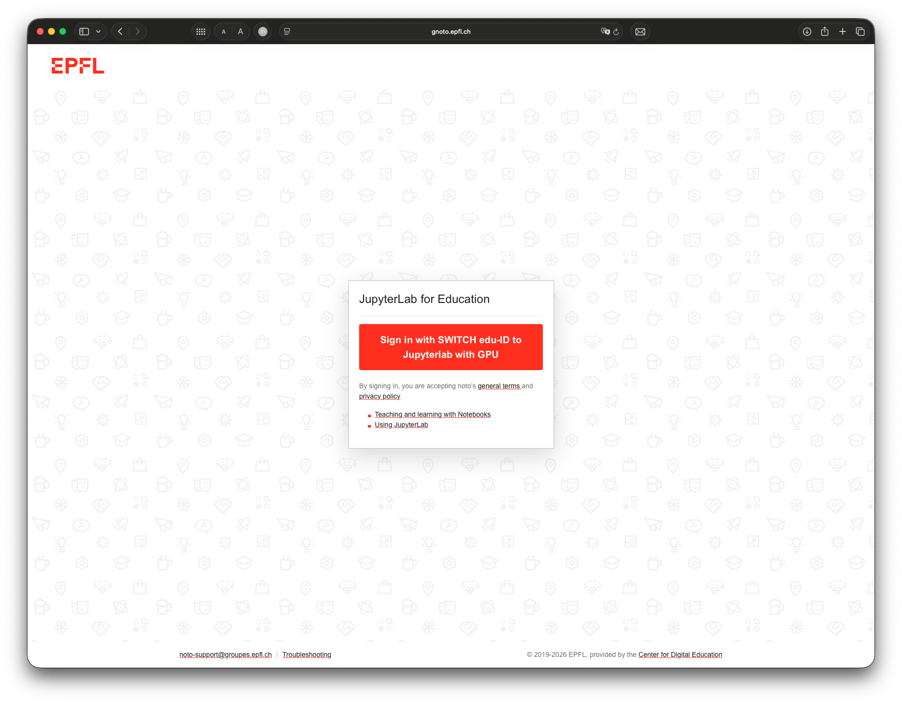
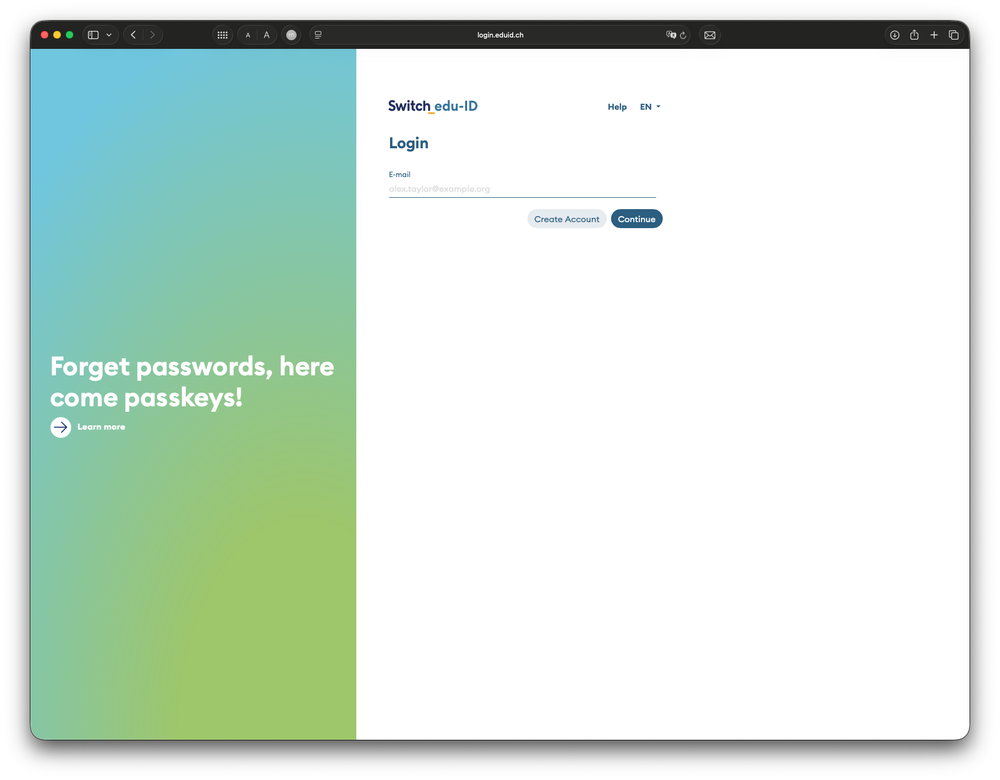
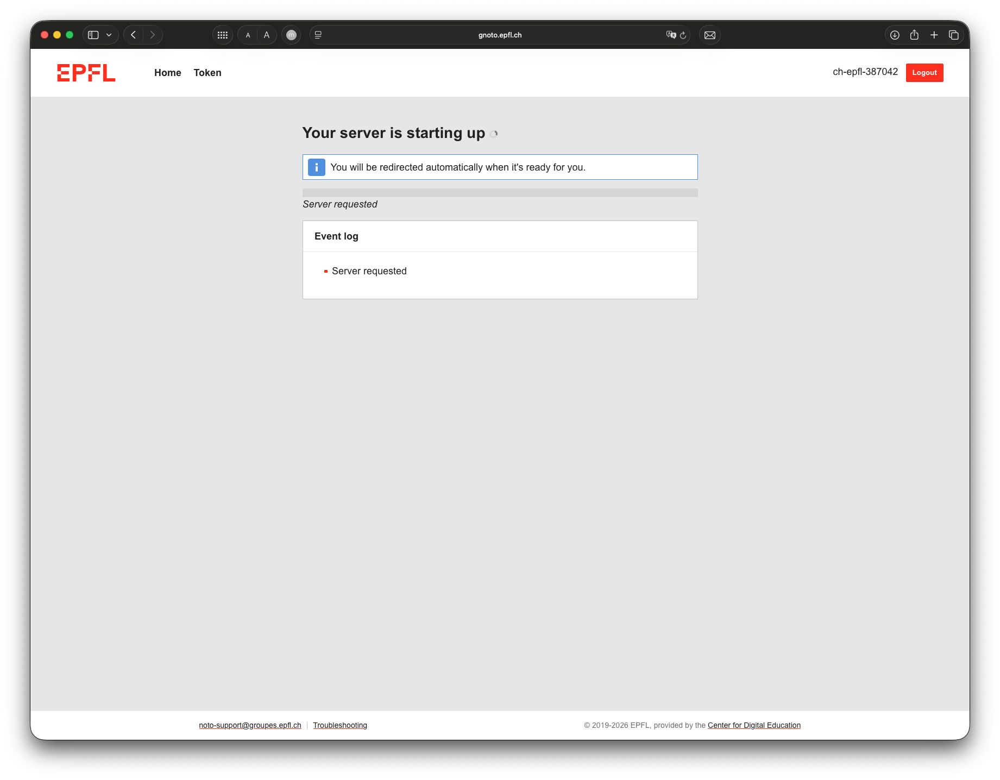
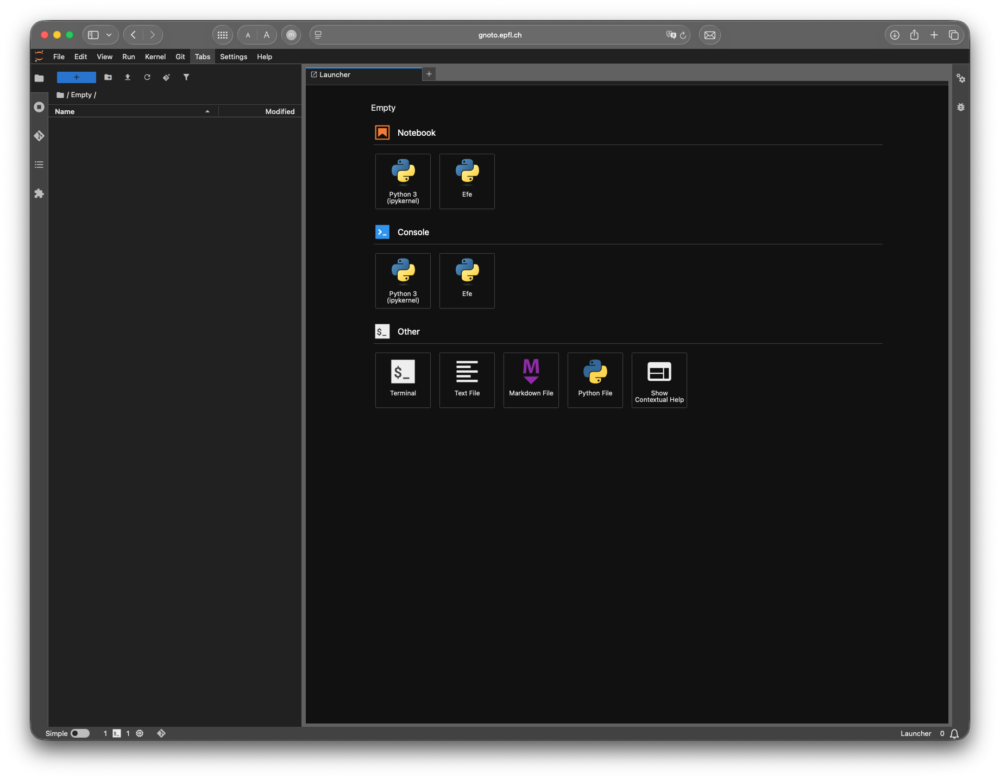

# Getting started with gnoto


---
# What is gnoto
gnoto is a compute service that provides GPU-powered Jupyter notebooks ([link](https://www.epfl.ch/research/facilities/rcp/gnoto/)). It is well suited for debugging, visualizations, and lightweight compute tasks.

## GPU specifications

Each student can have access to a single Jupyter notebook with 1 V100 GPU with ~10 GB VRAM. The GPU for all gnoto sessions is the same.

# How to create an account
We have already created gnoto accounts for students who are enrolled in the course. Please reach out to the teaching staff in case you face any difficulty in using your account.


# How to access gnoto
Follow these quick steps:

1. Go to [https://gnoto.epfl.ch/](https://gnoto.epfl.ch/).
2. Click **Login with Switch edu-ID** and sign in.
3. Wait while gnoto allocates resources to your session.
4. You will land in the gnoto workspace (Jupyter-like interface).

| 1. Entry page | 2. Switch edu-ID login |
| --- | --- |
|  |  |

| 3. Resource allocation | 4. Gnoto workspace |
| --- | --- |
|  |  |


# How to create a virtual environment 

Use a custom environment when you need extra packages beyond the default gnoto setup.

## 1. Create and activate a `venv`

```bash
my_venvs_create cs503_env
my_venvs_activate cs503_env
```

## 2. Install packages

After activation, install the packages you need with `pip`.
```bash
pip install matplotlib torch
```

## 3. List and remove environments

List all environments:

```bash
my_venvs_list
```

Remove an environment you no longer need:

```bash 
my_venvs_remove cs503_env
```

# How to create a notebook kernel

A new virtual environment is available in terminal sessions only. To use it in Jupyter notebooks, register it as a kernel.

## 1. Activate an existing environment
```bash
my_venvs_activate cs503_env
```

## 2. Create a kernel for this environment
```bash
my_kernels_create cs503_env "CS503 Environment"
```

## 3. Use in notebook

Open your notebook and select the kernel from the top-right kernel selector.

If the kernel does not appear immediately, stop the notebook from **Running Terminals and Kernels**, reopen it, and select the new kernel.


# FAQ

- **Will my data be retained after I re-login into the gnoto server?**

  Yes. Everything in the `/home/` directory will remain saved.

- **How do I copy/download data into the server?**

  On your own computer, you can use `rsync` [[link](https://scitas-doc.epfl.ch/user-guide/data-management/transferring-data/#using-rsync)] (recommended) or `scp` [[link](https://scitas-doc.epfl.ch/user-guide/data-management/transferring-data/#using-scp)]. Note: these links point to SCITAS documentation, but `rsync` and `scp` are general-purpose data transfer tools that work with any remote server, including gnoto.
